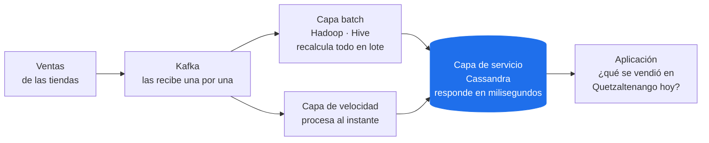

# Taller de Apache Cassandra

Curso *Big Data y su Relación con Generative AI*, UFM. Clase 17.

## Introducción

En el taller de Hadoop se contaron 75 000 ventas **en lote**, en minutos. En el de Kafka esas ventas
llegaron **una por una**. Falta el último paso: que una aplicación pregunte "¿qué se vendió en
Quetzaltenango el 1 de agosto?" y reciba la respuesta en milisegundos, aunque un servidor esté
caído. Ese es el trabajo de Cassandra, la **capa de servicio** (*serving layer*) de la arquitectura
Lambda. La usan Netflix, Apple y Discord.

Cassandra es una base de datos NoSQL de la familia **columnar** (*wide-column*): los datos se
guardan agrupados por una llave y repartidos entre varios servidores, sin uno que mande sobre los
demás.



En la arquitectura Lambda, Cassandra es donde la aplicación lee: guarda los resultados de las otras
capas organizados para responder rápido.

## Objetivo

Responder, con evidencia generada en tu propio clúster:

- ¿Por qué en Cassandra la tabla se diseña a partir de la consulta, y qué cuesta eso?
- Con un nodo apagado, ¿qué operaciones siguen funcionando y cuáles no, y quién lo decide?
- Cuando el nodo vuelve, ¿cómo se entera de lo que se escribió mientras estaba caído?

## Qué vas a construir

```
  clúster UFM-G# · datacenter dc-g# · una misma red (VPN o red local)

   laptop 1              laptop 2              laptop 3
  ┌────────────┐        ┌────────────┐        ┌────────────┐
  │ cassandra1 │ ◄────► │ cassandra2 │ ◄────► │ cassandra3 │
  └────────────┘        └────────────┘        └────────────┘

  keyspace ventas: cada dato en los 3 nodos
  cqlsh (CQL) · nodetool (administración), cada quien desde su nodo
```

- **Nodo**: un servidor de Cassandra. Todos son iguales: no hay NameNode ni controller. El que recibe
  una consulta la coordina.
- **Keyspace**: el equivalente a una base de datos; define cuántas copias hay de cada dato.
- **CQL**: el lenguaje de Cassandra. Se parece a SQL, pero no tiene JOIN.

## Contenido

| Parte | Modalidad | Tiempo estimado | Contenido |
|---|---|---|---|
| **[Parte 1 — Guiada](parte-1-guiada.md)** | En clase o por cuenta propia | 40 min – 1 h | Un nodo, un keyspace, una tabla, carga de las ventas y consultas. Todo el código se proporciona |
| **[Parte 2 — Tarea](parte-2-tarea.md)** | Tarea, en grupo | 3–4 h | El clúster del grupo: un nodo en la laptop de cada integrante, copias, CQL, niveles de consistencia, caída y recuperación de nodos. Dos pasos son de investigación |
| **[Mini-reto](ENTREGA.md#13-mini-reto-del-modelo-relacional-a-cassandra-25-)** | Tarea | 2.5–3 h | De un modelo relacional a un modelo de Cassandra, en el dominio de tu grupo |
| **[Entrega](ENTREGA.md)** | Tarea | 1 h | Bitácora y Pull Request |
| **Presentación** | Lunes 5-oct, en clase | 10 min por grupo | Modelo, demo en vivo y preguntas |
| **Total** | | **7–9 h** | Sin contar la presentación |

La Parte 1 no se califica y es prerrequisito de la Parte 2.

**Dudas:** en clase.

## Qué entregas y cuánto vale

El detalle de cada punto está en [`ENTREGA.md`](ENTREGA.md).

| Qué entregas | Quién | % |
|---|---|---|
| **Bitácora** | Individual | **50** |
| · Evidencias de tu clúster (E1 a E6b) | | 15 |
| · 3 preguntas respondidas con tus datos | | 10 |
| · Mini-reto: modelo relacional → Cassandra | | 25 |
| **Presentación del lunes 5 de octubre** | | **50** |
| · Modelo de datos y justificación | Grupal | 20 |
| · Demo en vivo: un nodo caído, `QUORUM` frente a `ALL` | Grupal | 20 |
| · Respuesta a una pregunta del catedrático | Individual | 10 |
| **Total** | | **100** |

**Fecha de entrega: lunes 5 de octubre, 4:00 PM** (hora de Guatemala), por Pull Request. Hasta el
viernes 9 de octubre a las 4:00 PM se acepta tarde, y vale la mitad; después, no se recibe.

## Requisitos

1. **Docker Desktop** (<https://www.docker.com/products/docker-desktop/>), con 2 GB de RAM para
   Docker en *Settings → Resources*: cada laptop corre un nodo, de unos 1.3 GB. La memoria del nodo
   se ajusta en `compose.yml` (`MAX_HEAP_SIZE`).
2. **Una red común para las tres laptops del grupo** en la Parte 2: una VPN de malla o una misma red
   local.
3. **Fork del repo.** Un *fork* es tu copia del repo en tu cuenta de GitHub; desde ahí se abre el
   Pull Request de la entrega. Haz **Fork** de
   <https://github.com/jcarriolaa/Big-Data-Workshops-Cassandra> y clona **tu** fork:

   ```bash
   git clone https://github.com/TU-USUARIO/Big-Data-Workshops-Cassandra.git
   cd Big-Data-Workshops-Cassandra
   ```

Todos los comandos del taller se corren **desde la carpeta del repo**.

Siguiente: **[Parte 1](parte-1-guiada.md)**.
