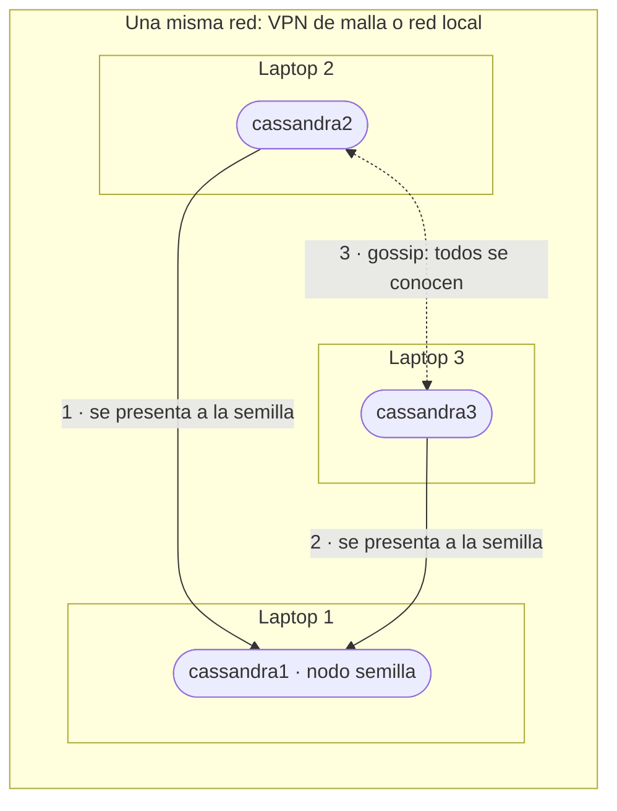
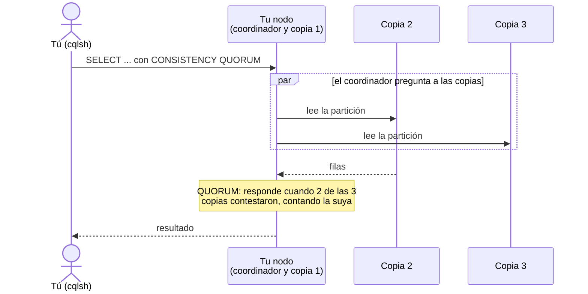
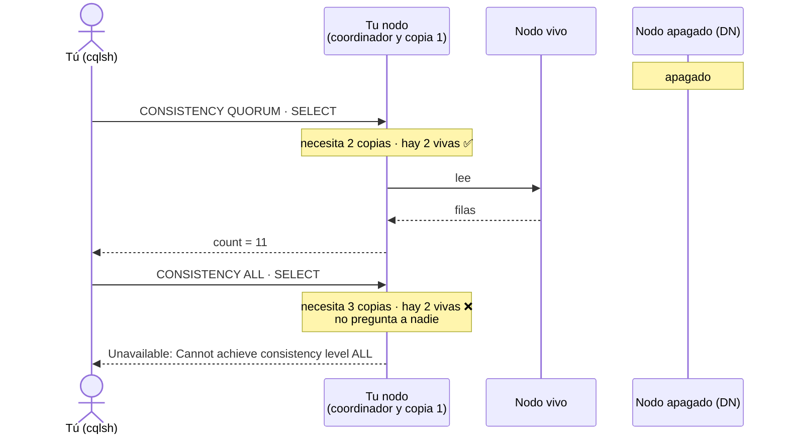
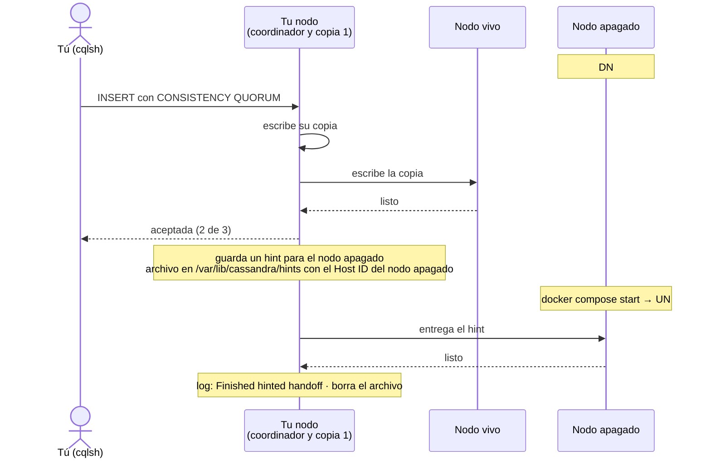

# Parte 2 — Tarea: el clúster del grupo

Los tres integrantes del grupo arman **un solo clúster**: un nodo en la laptop de cada uno. Los
Pasos 5 y 7 son de **investigación**: se da el estado esperado y la documentación oficial; la
configuración la resuelves tú. Los demás dan el código.

La bitácora es individual: cada quien toma sus evidencias (📸 E1 a E6b) desde **su** nodo. El formato
está en [`ENTREGA.md`](ENTREGA.md).

Antes de empezar, el grupo acuerda qué nodo tiene cada integrante: `cassandra1`, `cassandra2` o
`cassandra3`. En los comandos:

- `<tu-nodo>` es el nombre de tu nodo.
- `G1`, `UFM-G1` y `dc-g1` corresponden al grupo 1: sustitúyelos por los de tu grupo.
- `docker compose stop` y `docker compose start` de un nodo se corren en la laptop de ese nodo.

---

## Práctica opcional: los tres nodos en tu laptop

No se entrega y no lleva evidencias. Necesita 5 GB de RAM para Docker (recomendado 6 GB). Estado
esperado:

- En un `compose.yml` aparte, tres servicios: `cassandra1`, `cassandra2` y `cassandra3`, cada uno con
  su volumen, y el puerto CQL de cada uno publicado en tu máquina: `9042`, `9043` y `9044`.
- Nombre del clúster: `UFM-G1`. Datacenter de los tres nodos: `dc-g1`. `cassandra1` es el nodo
  semilla.
- `docker compose up -d` levanta los tres nodos sin intervención, uno después del otro, y
  `docker exec cassandra1 nodetool status` muestra tres nodos `UN`.

Los Pasos 6 a 9 se pueden ensayar sobre este clúster antes de hacerlos con el grupo.

---

## Paso 5: El clúster del grupo 🔎

El clúster de la Parte 1 usa los nombres por defecto y vive en una sola laptop. Un clúster de
producción tiene nombre propio, reparte sus nodos entre máquinas distintas y declara en qué
**datacenter** vive cada nodo; con eso Cassandra decide dónde guardar las copias.



No hay un nodo que mande: la semilla solo es el punto de encuentro para unirse. Después, los nodos
se cuentan entre sí quién está vivo (*gossip*).

Empieza desde cero. Si hiciste la práctica opcional, antes corre `docker compose down -v` en su
carpeta. Esto borra el nodo de la Parte 1 y sus datos:

```bash
docker compose down -v
```

### Estado esperado

- Las tres laptops están en una misma red y cada una alcanza a las otras dos por su IP: una **VPN de
  malla** (*mesh VPN*) como Tailscale, ZeroTier, NetBird o NordVPN Meshnet, o una misma red local.
- En tu `compose.yml`, un solo servicio; su nombre y su `container_name` son el nodo que te tocó.
  `cassandra1` es el nodo semilla (*seed*): el punto de contacto de los otros dos para unirse.
- Cada nodo anuncia a los demás la IP de su laptop en esa red, y publica los puertos `7000`
  (comunicación entre nodos) y `9042` (CQL).
- Nombre del clúster: `UFM-G1`. Datacenter de los tres nodos: `dc-g1`.
- Los nodos se levantan uno después del otro: primero `cassandra1`; cada uno, cuando el anterior ya
  está `UN`.
- En **cada** laptop, `docker exec <tu-nodo> nodetool status` muestra `Datacenter: dc-g1` y tres
  nodos `UN`, con las IP de las laptops en la columna `Address`, y
  `docker exec <tu-nodo> nodetool describecluster` muestra `Name: UFM-G1`.

### Documentación

- Variables de la imagen oficial: <https://hub.docker.com/_/cassandra>
- `cluster_name`, `seed_provider`, `endpoint_snitch`, `listen_address` y `broadcast_address`:
  <https://cassandra.apache.org/doc/5.0/cassandra/managing/configuration/cass_yaml_file.html>
- Datacenter y rack de un nodo:
  <https://cassandra.apache.org/doc/5.0/cassandra/managing/configuration/cass_rackdc_file.html>
- VPN de malla: <https://tailscale.com/kb/1017/install>, <https://docs.zerotier.com/start/>,
  <https://docs.netbird.io/get-started>, <https://meshnet.nordvpn.com/getting-started/how-to-start-using-meshnet>
- Orden de arranque en Compose (práctica opcional): <https://docs.docker.com/compose/how-tos/startup-order/>

### ❌ Si falla

| Síntoma | Arreglo |
|---|---|
| `Saved cluster name Test Cluster != configured name UFM-G1` | El volumen conserva datos de otro clúster: `docker compose down -v`. |
| `Bootstrap Token collision` | El arranque no es secuencial (ver Estado esperado). |
| Un nodo se detiene solo | `docker compose logs <tu-nodo>`: la última línea con `ERROR` indica la causa. |

### 📸 E1

---

## Paso 6: Tres copias de cada venta

El keyspace de la Parte 1 usaba `SimpleStrategy`, que ignora los datacenters. En un clúster con
datacenters se usa `NetworkTopologyStrategy`, que fija cuántas copias van a cada uno.

**Quien tiene `cassandra1`** crea el keyspace y la tabla, y carga las ventas. Se hace una sola vez
por clúster:

```bash
docker exec -it cassandra1 cqlsh
```

```sql
CREATE KEYSPACE ventas
  WITH replication = {'class': 'NetworkTopologyStrategy', 'dc-g1': 3};

CREATE TABLE ventas.ventas_por_ciudad (
  ciudad          text,
  fecha           date,
  id_venta        int,
  pais            text,
  categoria       text,
  producto        text,
  cantidad        int,
  precio_unitario decimal,
  canal           text,
  PRIMARY KEY ((ciudad), fecha, id_venta)
) WITH CLUSTERING ORDER BY (fecha DESC, id_venta ASC);
```

El nombre del datacenter va entre comillas simples, como texto. Sal de `cqlsh` y carga las ventas
del grupo:

```bash
docker exec cassandra1 cqlsh -e "COPY ventas.ventas_por_ciudad (id_venta, fecha, pais, ciudad, categoria, producto, cantidad, precio_unitario, canal) FROM '/data/ventas/ventas_G1.csv' WITH HEADER = true;"
```

**Cada integrante**, cuando termina la carga, desde su nodo: ¿en qué nodos vive la partición de
Quetzaltenango?

```bash
docker exec <tu-nodo> nodetool getendpoints ventas ventas_por_ciudad Quetzaltenango
docker exec <tu-nodo> cqlsh -e "DESCRIBE KEYSPACE ventas;"
```

```
172.18.0.3
172.18.0.2
172.18.0.4

CREATE KEYSPACE ventas WITH replication = {'class': 'NetworkTopologyStrategy', 'dc-g1': '3'}  AND durable_writes = true;
```

El `DESCRIBE` imprime después el `CREATE TABLE` completo.

Tres direcciones: una por nodo, las mismas de la columna `Address` de `nodetool status`; en el
clúster del grupo son las IP de las laptops. Con 3 copias y 3 nodos, cada nodo tiene todos los
datos; en un clúster de 30 nodos, cada partición viviría en 3 de ellos.

```
 "Quetzaltenango" ──hash──► un punto del anillo de tokens
 El nodo dueño de ese punto y los siguientes guardan una copia cada uno, hasta 3 (RF=3).

        3 nodos                                   6 nodos

      cassandra1 ●                                ● n1
     ╱            ╲                           n6 ●      ● n2 ◄── copia 1
 cassandra3 ●──────● cassandra2               n5 ●      ● n3 ◄── copia 2
                                                   ● n4    ◄── copia 3

 las 3 copias, una en cada nodo           las 3 copias en 3 de los 6 nodos
```

Simplificado: cada nodo es dueño de 16 puntos del anillo, no de uno (columna `Tokens` de
`nodetool status`).

### ✅ Checkpoint

```bash
bash scripts/check.sh cluster
```

```
✅ Nodos en esta laptop: cassandra2
✅ Nodos en estado UN: 3
✅ Nombre del cluster: UFM-G1
✅ Datacenter: dc-g1
✅ Keyspace ventas con 3 copias en dc-g1
✅ ventas.ventas_por_ciudad tiene 75000 filas

Todo en orden.
```

La primera línea muestra tu nodo.

### ❌ Si falla

| Síntoma | Arreglo |
|---|---|
| `ConfigurationException: Unrecognized strategy option {dc1} passed to NetworkTopologyStrategy` | El datacenter del keyspace no coincide con el de `nodetool status`. |
| `nodetool: getendpoints requires keyspace, table and partition key arguments` | La clave lleva espacios: usa una ciudad de una sola palabra. |

### 📸 E2

---

## Paso 7: CQL más allá del SELECT 🔎

En Cassandra, escribir no funciona como en SQL. Investiga y comprueba en `ventas.ventas_por_ciudad`,
desde tu nodo, tres comportamientos.

### Estado esperado

1. **Upsert.** Dos `INSERT` con la misma llave primaria y valores distintos dejan **una sola** fila,
   con los valores del segundo.
2. **TTL.** Una fila insertada con un tiempo de vida de 60 segundos: `SELECT` la muestra con su TTL
   restante, y pasado ese tiempo el mismo `SELECT` devuelve `(0 rows)`.
3. **Lightweight transaction.** Un `INSERT ... IF NOT EXISTS` sobre la llave del punto 1 no se
   aplica: la respuesta muestra `[applied] False` y la fila que ya existía.

Usa fechas de enero de 2025 y tu carné como `id_venta`, para no mezclar estas filas con las ventas
del grupo ni con las de tus compañeros.

### Documentación

- `INSERT`, `USING TTL` e `IF NOT EXISTS`:
  <https://cassandra.apache.org/doc/5.0/cassandra/developing/cql/dml.html>
- Función `TTL()`:
  <https://cassandra.apache.org/doc/5.0/cassandra/developing/cql/functions.html>

### 📸 E3

---

## Paso 8: Consistencia por operación

Cada operación en Cassandra declara su **nivel de consistencia**: cuántas copias tienen que
responder para que la operación tenga éxito. Con 3 copias:

| Nivel | Copias que deben responder |
|---|---|
| `ONE` | 1 |
| `QUORUM` | La mayoría: 2 |
| `ALL` | Las 3 |

En `cqlsh`, `CONSISTENCY` fija el nivel para las operaciones siguientes de la sesión.

Tu consulta llega a tu nodo, que hace de **coordinador**: la reparte entre las copias y responde
cuando contestaron las que pide el nivel.



Tu nodo siempre queda encendido: los que se apagan son los de tus compañeros. Según tu nodo:

| Tu nodo | 8.1 y Paso 9: se apaga | 8.2: se apagan |
|---|---|---|
| `cassandra1` | `cassandra3` | `cassandra2` y `cassandra3` |
| `cassandra2` | `cassandra3` | `cassandra1` y `cassandra3` |
| `cassandra3` | `cassandra1` | `cassandra1` y `cassandra2` |

Cada integrante toma sus evidencias con su propia fila de la tabla; al terminar cada ronda, se
encienden los nodos apagados. 8.1 y el Paso 9 se hacen en dos rondas (se apaga `cassandra3`, luego
`cassandra1`); 8.2, en tres. En las salidas de ejemplo, el nodo apagado es `cassandra3`.

### 8.1 Un nodo caído

En la laptop del nodo que se apaga:

```bash
docker compose stop <nodo-que-se-apaga>
```

En tu laptop:

```bash
docker exec <tu-nodo> nodetool status
docker exec -it <tu-nodo> cqlsh
```

El nodo apagado aparece como `DN` (**D**own).

```sql
CONSISTENCY QUORUM;
SELECT count(*) FROM ventas.ventas_por_ciudad WHERE ciudad = 'Quetzaltenango' AND fecha = '2024-08-01';

CONSISTENCY ALL;
SELECT count(*) FROM ventas.ventas_por_ciudad WHERE ciudad = 'Quetzaltenango' AND fecha = '2024-08-01';
```

```
Consistency level set to QUORUM.

 count
-------
    11

(1 rows)
Consistency level set to ALL.
NoHostAvailable: ('Unable to complete the operation against any hosts', {<Host: 127.0.0.1:9042 dc-g1>: Unavailable('Error from server: code=1000 [Unavailable exception] message="Cannot achieve consistency level ALL" info={\'consistency\': \'ALL\', \'required_replicas\': 3, \'alive_replicas\': 2}')})
```

Con un nodo apagado, el coordinador sabe de antemano cuántas copias están vivas:



Sal de `cqlsh` con `exit`.

### 📸 E4

### 8.2 Dos nodos caídos

Se apagan los dos nodos de tu fila en la tabla, cada uno en su laptop. En la tuya:

```bash
docker exec <tu-nodo> nodetool status
docker exec -it <tu-nodo> cqlsh
```

```sql
CONSISTENCY ONE;
SELECT count(*) FROM ventas.ventas_por_ciudad WHERE ciudad = 'Quetzaltenango' AND fecha = '2024-08-01';

CONSISTENCY QUORUM;
SELECT count(*) FROM ventas.ventas_por_ciudad WHERE ciudad = 'Quetzaltenango' AND fecha = '2024-08-01';
```

```
Consistency level set to ONE.

 count
-------
    11

(1 rows)
Consistency level set to QUORUM.
NoHostAvailable: ('Unable to complete the operation against any hosts', {<Host: 127.0.0.1:9042 dc-g1>: Unavailable('Error from server: code=1000 [Unavailable exception] message="Cannot achieve consistency level QUORUM" info={\'consistency\': \'QUORUM\', \'required_replicas\': 2, \'alive_replicas\': 1}')})
```

Sal de `cqlsh` con `exit`.

### 📸 E5

### 8.3 La tabla completa

Repite la misma lectura con `ONE`, `QUORUM` y `ALL` en los tres escenarios (0, 1 y 2 nodos caídos) y
llena en tu bitácora la tabla de resultados: ✅ si responde, ❌ si se rechaza. Al terminar, los tres
nodos quedan encendidos.

### ✅ Checkpoint

Con un nodo caído, `QUORUM` responde y `ALL` se rechaza. Con dos caídos, `ONE` responde y `QUORUM`
se rechaza.

### ❌ Si falla

| Síntoma | Arreglo |
|---|---|
| `Error response from daemon: container ... is not running` | Ese nodo está apagado: la consola va en tu nodo. |

---

## Paso 9: El nodo que vuelve

Si un nodo está caído, ¿qué pasa con lo que se escribe mientras tanto? El coordinador guarda una
nota para él, un **hint**, y se la entrega cuando vuelve (*hinted handoff*).



Se apaga el nodo de tu fila para el Paso 9 (en la laptop de ese nodo):

```bash
docker compose stop <nodo-que-se-apaga>
```

Espera a que `nodetool status` lo muestre como `DN` y escribe, desde tu nodo, una venta con `QUORUM`
y tu carné como `id_venta` (aquí, `20241234`):

```bash
docker exec <tu-nodo> cqlsh -e "CONSISTENCY QUORUM; INSERT INTO ventas.ventas_por_ciudad (ciudad, fecha, id_venta, pais, producto, cantidad, precio_unitario, canal) VALUES ('Quetzaltenango', '2025-12-31', 20241234, 'Guatemala', 'Cafe', 3, 95.00, 'web');"
```

Tu nodo coordinó esa escritura. Pasados 10 segundos, el hint está en su disco:

```bash
docker exec <tu-nodo> ls /var/lib/cassandra/hints
docker exec <tu-nodo> nodetool status
```

```
99a624a6-3b4f-446d-94b3-64d20c1826f1-1790615739959-2.hints
Datacenter: dc-g1
=================
Status=Up/Down
|/ State=Normal/Leaving/Joining/Moving
--  Address     Load      Tokens  Owns (effective)  Host ID                               Rack 
UN  172.18.0.3  1.8 MiB   16      100.0%            127bda6d-1232-4d93-855e-c0ef8e018ecc  rack1
DN  172.18.0.4  1.79 MiB  16      100.0%            99a624a6-3b4f-446d-94b3-64d20c1826f1  rack1
UN  172.18.0.2  1.15 MiB  16      100.0%            7900f996-89d9-4de0-bc38-fd88c4fb986e  rack1
```

El archivo lleva el **Host ID** del nodo apagado: el mismo que `nodetool status` muestra en la fila
`DN`.

### 📸 E6a

Se enciende el nodo apagado (en su laptop):

```bash
docker compose start <nodo-que-se-apaga>
```

Pasados unos 30 segundos, busca la entrega en el registro de tu nodo:

```bash
docker logs <tu-nodo> 2>&1 | grep "Finished hinted handoff"
```

```
INFO  [HintsDispatcher:1] 2026-09-28T17:16:10,213 HintsDispatchExecutor.java:300 - Finished hinted handoff of file 99a624a6-3b4f-446d-94b3-64d20c1826f1-1790615739959-2.hints to endpoint /172.18.0.4:7000: 99a624a6-3b4f-446d-94b3-64d20c1826f1
```

Tu venta ya está en el nodo que volvió. Léela ahí, con `ONE`, apuntando `cqlsh` a la IP de su laptop:

```bash
docker exec <tu-nodo> cqlsh <IP-del-nodo-que-volvió> -e "CONSISTENCY ONE; SELECT id_venta, producto, cantidad FROM ventas.ventas_por_ciudad WHERE ciudad = 'Quetzaltenango' AND fecha = '2025-12-31';"
```

### 📸 E6b

### ✅ Checkpoint

`ls` muestra un archivo `.hints` con el Host ID del nodo apagado, y el registro muestra
`Finished hinted handoff` hacia su dirección.

### ❌ Si falla

| Síntoma | Arreglo |
|---|---|
| `ls` no muestra archivos | El hint se escribe a disco cada 10 segundos: espera y repite. Si sigue vacío, el nodo no estaba `DN` al escribir. |
| `grep` no muestra nada | La entrega ocurre cuando el nodo ya está `UN`: espera y repite. |

Documentación: <https://cassandra.apache.org/doc/5.0/cassandra/managing/operating/hints.html>

---

## Paso 10: Limpieza

**Después** de terminar la bitácora y el mini-reto, y de presentar el lunes 5-oct, cada integrante
en su laptop:

```bash
docker compose down -v
```

Borra los contenedores y los volúmenes del taller, y nada más.

### ✅ Checkpoint

```bash
docker compose ps -a
```

La lista está vacía.
